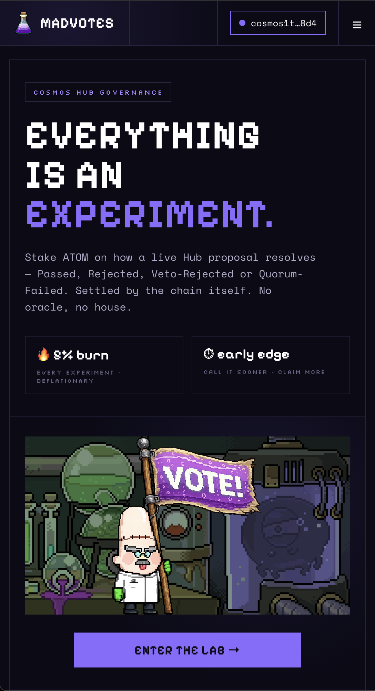
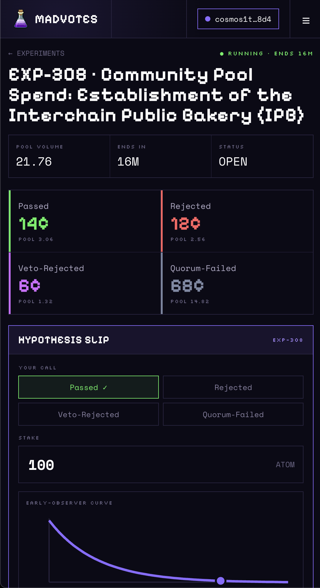
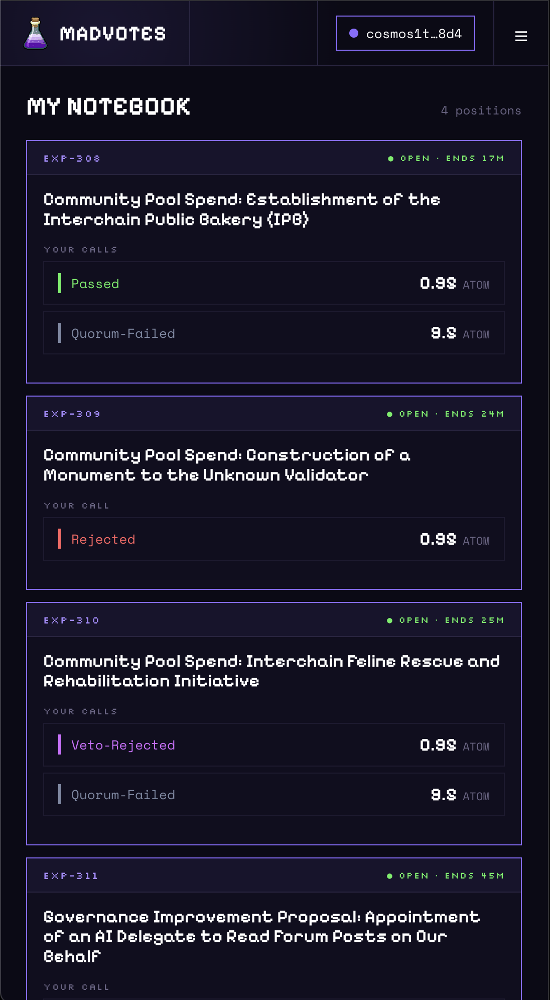

# MadVotes

**A prediction market for Cosmos Hub governance — where the blockchain itself is the referee.**

MadVotes turns every live governance proposal on the Cosmos Hub into an _experiment_
you can bet ATOM on. Will the proposal **Pass**? Be **Rejected**? Get
**Veto-Rejected**? Or fail for lack of **Quorum**? Call it, stake on it, and when
the proposal finishes the chain's own recorded result pays out the people who
got it right.

> Everything is an experiment.

This repository is the **web frontend**. It's a single-page React app that talks
directly to a CosmWasm smart contract (`cw-gov-predict`) on the Cosmos Hub — there
is no backend server, no database, and no central operator holding funds.

---

## Screenshots

| Landing                                                  | Market detail                                                                                 | Notebook                                                            |
| -------------------------------------------------------- | --------------------------------------------------------------------------------------------- | ------------------------------------------------------------------- |
|  |           |       |
| The "enter the lab" hero — connect a wallet to begin.    | An experiment's four-way odds grid, the hypothesis slip, and the early-observer weight curve. | Your positions across markets, with claimable payouts once settled. |

---

## Why is this interesting?

Most prediction markets need a **trusted oracle** — some person or committee who,
after the fact, declares "this is what happened" so the market can pay out. That
oracle is the weak point: it can be wrong, slow, bribed, or disputed.

MadVotes doesn't have that problem, because the thing it's predicting _is already
on-chain_. The outcome of a governance proposal is recorded by the Cosmos Hub as
a matter of consensus. The contract just reads it. A few mechanisms make this
more than a coin-flip:

### 1. Oracle-free, self-settling markets

The market is about governance, and governance results live on the same chain as
the market. When voting ends, the proposal's final status is canonical and
undisputable. **Settlement requires no trusted reporter** — there's nothing to
argue about and no house that can refuse to pay. This is only possible because
the prediction target and the settlement source are the same ledger.

### 2. Four real outcomes, not a yes/no bet

Cosmos governance doesn't just "pass or fail." A proposal can:

| Outcome           | What it means                                                                                   |
| ----------------- | ----------------------------------------------------------------------------------------------- |
| **Passed**        | Adopted by the voters.                                                                          |
| **Rejected**      | Voted down on the merits.                                                                       |
| **Veto-Rejected** | Rejected _with_ a veto-level `NoWithVeto` vote — a stronger signal that also burns the deposit. |
| **Quorum-Failed** | Not enough of the bonded stake voted; the proposal fails for lack of participation.             |

These are genuinely distinct governance states with different political meaning.
Modeling all four (instead of collapsing to "pass/fail") lets the market price
_how_ a proposal dies, which is often the more interesting question.

### 3. Time-weighted payouts: rewarding conviction under uncertainty

This is the heart of the design. In a naive pool market, the smart move is to
wait until the result is nearly certain and pile in at the last second for a
near-risk-free cut. That's boring and parasitic — it adds no information.

MadVotes weights each stake by **how early it was placed**. A bet made while the
outcome is still genuinely uncertain earns a larger share of the winnings than an
identical bet made at the last moment. The weight decays exponentially across the
voting window:

```
w(f) = (e^(k·f) − 1) / (e^k − 1)          k = 5,   f = fraction of voting window remaining
```

So `f = 1` at the open (full weight) and `f = 0` at the close (no early-edge
bonus). Two people who staked the same amount on the same winning outcome can
receive very different payouts depending on _when_ each committed. The app plots
exactly where your stake lands on this curve before you sign.

The effect: MadVotes pays you for being **early and right** — for taking a view
when it actually costs something to be wrong — rather than for front-running a
foregone conclusion.

### 4. A deflationary "reagent burn"

Every stake is charged a flat **5% burn** the moment it's placed (we call it the
_reagent burn_). Those ATOM are removed from supply permanently. It makes the
protocol deflationary, discourages spam/wash betting, and keeps the "everything
is an experiment" framing honest — running an experiment consumes reagents.

---

## How a round works

1. **A proposal goes live** on the Cosmos Hub and is registered as a market.
2. **You place a hypothesis** — pick one of the four outcomes and bet ATOM.
   5% is burned; the remaining 95% (your _net_) is added to that outcome's pool,
   scaled by your early-observer weight.
3. **Voting ends and the chain records a result.** The market reads it; no oracle
   needed.
4. **Winners claim.** If your outcome won, you get your net stake back **plus** a
   share of every losing outcome's pool, proportional to your time-weighted
   contribution.

### The payout, concretely

For a winning position, the contract computes:

```
burn   = stake × 5%
net    = stake − burn
payout = net + L × (net·w) / (Ω + net·w)
```

where **L** is the combined pool of the losing outcomes, **w** is your
early-observer weight, and **Ω** is the winning outcome's total weighted stake.
In plain terms: _you get your net stake back, plus a slice of the losers' pool
sized by how much — and how early — you committed relative to everyone else who
called it right._ (See [`src/utils/bet.ts`](src/utils/bet.ts) and
[`src/utils/betWeight.ts`](src/utils/betWeight.ts) — the frontend mirrors the
contract math exactly, pinned by a shared test vector so the two can't drift.)

---

## Architecture

```
┌─────────────────────┐    read (queries)       ┌─────────────────────────┐
│  MadVotes web app    │ ─────────────────────▶  │                         │
│  (this repo)         │                         │  cw-gov-predict CosmWasm│
│                      │ ◀─────────────────────  │  contract on Cosmos Hub  │
│  React + cosmos-kit  │    sign (PlaceBet,       │                         │
└─────────────────────┘     Claim) via wallet    └─────────────────────────┘
```

- **No backend.** The app reads contract state directly over RPC and submits
  transactions through the user's wallet.
- **Read path:** a read-only `MadvotesQueryClient` (in `src/codegen`) feeds
  TanStack Query hooks for markets, pools, positions and claims.
- **Write path:** a wallet-signed `MadvotesClient` builds `PlaceBet` / `Claim`
  messages. (Because of an SDK 0.50 ↔ cosmjs 0.32 quirk where successful txs
  return an empty `raw_log`, bets are broadcast via a message composer +
  `signAndBroadcast` rather than the generated `execute`, which would choke
  parsing the empty log — see `src/components/MarketDetail/ConfirmModal.tsx`.)

### Tech stack

| Concern           | Choice                                                          |
| ----------------- | --------------------------------------------------------------- |
| UI                | React 18 (Create React App via `react-app-rewired`)             |
| Routing           | React Router v6 (`HashRouter`, GitHub-Pages deep-link safe)     |
| Wallets           | cosmos-kit (Keplr, Leap)                                        |
| Chain I/O         | CosmJS (`@cosmjs/cosmwasm-stargate`)                            |
| Data fetching     | TanStack Query v4                                               |
| Contract bindings | `ts-codegen`-generated client in `src/codegen`                  |
| Styling           | Inline design tokens ("Cosmos Violet" system in `src/theme.ts`) |

### Project layout

```
src/
  components/
    Landing/          Screen 01 — the "enter the lab" hero + wallet connect
    LiveExperiments/  The market list (newest first), marquee, cards
    MarketDetail/     Odds grid, hypothesis slip, early-observer curve, confirm modal
    Notebook/         Your positions + claimable payouts
    Docs/             FAQ — how the mechanisms work, in plain language
    AppHeader/        Responsive nav (collapses to a menu on small screens)
  hooks/              Contract clients, user positions, useMediaQuery
  utils/              bet math (bet.ts), early-observer weighting (betWeight.ts), formatting
  codegen/            Generated contract client/types (do not hand-edit)
  theme.ts            Design tokens, outcome colors/labels
```

---

## Running it locally

```bash
yarn            # install
yarn start      # dev server at http://localhost:3000
yarn test       # unit tests (incl. the bet-weight vector that pins contract parity)
yarn build      # production build
```

### Deployment

Pushing to `main` deploys to GitHub Pages via the `Deploy` workflow
(`.github/workflows/deploy.yml`). To publish manually:

```bash
yarn deploy
```

---

## Network & contract

MadVotes currently runs on the **Cosmos Hub provider testnet** (`chain_id:
provider`), so you're staking **testnet ATOM**, not mainnet funds. Make sure your
wallet is on the provider testnet before connecting.

|          |                                                                     |
| -------- | ------------------------------------------------------------------- |
| Chain    | Cosmos Hub provider testnet (`provider`)                            |
| Denom    | `uatom`                                                             |
| Contract | `cosmos1rwgrc7xq5zn3neyhe3va04f9zy4z5n7la2ql9el5973dx0jclpdq804tre` |

Network constants live in [`src/utils/constants.ts`](src/utils/constants.ts).

---

## Status & disclaimers

This is **experimental software on a testnet**. The economic parameters (5% burn,
1 ATOM minimum, the `k = 5` weight curve) mirror the contract spec but should be
treated as subject to change, and the frontend's payout figures are _projections_
— the final number depends on how the pools look at settlement. Don't stake
anything you'd mind losing, and read the proposal you're betting on directly on
the Hub before you run a hypothesis.
